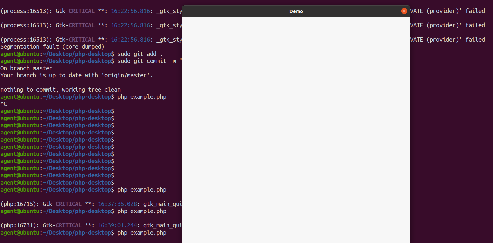

# PHP Desktop
Create GUI applications for Linux systems using php. [Ambitious but rubbish?](#nb) ¯\\\_(ツ)_/¯


## Installation
- Clone repository
  ```bash
  git clone https://github.com/grephq/php-desktop.git
  ```
- Enable extension loading in ```php.ini```
  ```ini
  enable_dl = On
  ```
- Run ```setup.sh```
## Usage
https://github.com/grephq/php-desktop/wiki

## N.B.
Adding widgets crashes the application. Why? I don't know. https://github.com/grephq/php-desktop/issues/1

## TODO
- Fix https://github.com/grephq/php-desktop/issues/1
- Implement messagedialog, radio and menu bar widgets
- Support for multiple windows
- Callback for application events
